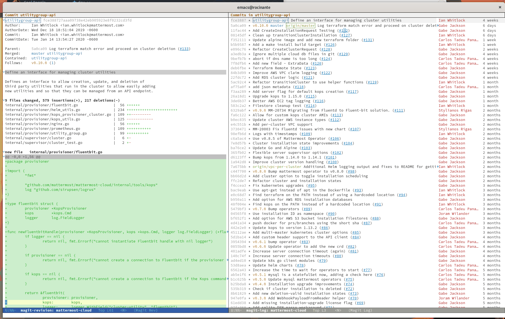
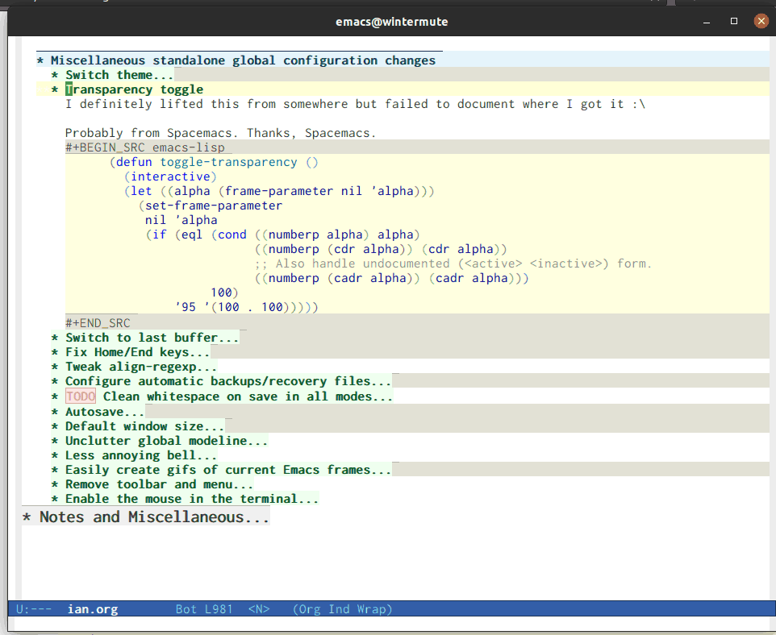

- [What is this?](#orgb89e686)
- [Entrypoint](#org3c37b87)
- [My Environment](#org150e1f6)
  - [Bootstrap](#orgefef467)
  - [Package Installation and Configuration](#org9b32d6c)
  - [Extra Packages](#org674b516)
  - [Language Configuration](#org8a35b97)
  - [Global Keybindings](#org7484019)
  - [Org Mode Settings](#org95554df)
  - [Miscellaneous standalone global configuration changes](#orga838203)
  - [ERC (IRC config)](#orgba3dc20)
  - [Render this file for display on the web](#org7d12321)
  - [Hostname-based tweaks](#orgccfd4eb)
  - [Footer](#orgb7bed01)
  - [Styles for HTML export](#orgd0f378a)
  - [Launching Emacsclient](#orgb466da5)
  - [Update README.md git hook](#org7e17b22)
  - [Running Emacs as a daemon](#org3a77840)
  - [Opening Code Links in Emacs](#orga40768c)


<a id="orgb89e686"></a>

# What is this?

This is my Emacs configuration, which I install at `~/.emacs.d` in all of my development environments. It's written in [Org Mode syntax](https://orgmode.org/), which is an Emacs-native plain text format (like Markdown with metadata) which displays beautifully inside of Emacs and exports to a number of other formats for display in places like this README and the web, and allows extraction of source code blocks into plain source code files through a process called "tangling," so the source code embedded below is ultimately run as my real programming environment. It also serves as a living document / blog about Emacs and my development environment as it evolves to meet my changing needs.

Writing the code in this file and tangling it to its final destination allows me to keep everything in one place, which helps me later figure out what changes I've made. This may seem counterintuitive, but over time I have accumulated configuration settings and files that need to be installed outside of Emacs's configuration directory, and tangling provides me with a way to document that these files have been installed, and what their contents are, in a place where I can remember to discover them in the future.

In addition, Emacs's `eval-last-sexp` allows me to test the configuration as I add it to the file, which allows me to feel confident that the saved code works.

It also encourages me to explain what I'm doing and why, so that when I come back to the configuration in a year or two, I know what it is, and how safe it is to remove it if the configuration is no longer desired.

If you're reading this on the web, the source code for this file can be found [on GitHub](https://github.com/gigawhitlocks/emacs-configs/blob/master/ian.org). If you want to try out this configuration file, run the following:

```bash
git clone https://github.com/gigawhitlocks/emacs-configs ~/.emacs.d
mv ~/.emacs.d/local/wintermute.org ~/.emacs.d/local/"$(hostname)".org
emacs
```

There are no guarantees that this configuration will work for you out of the box like that, but this is how I bootstrap onto new machines. This stuff is for personal use, so it isn't tested on systems I don't have, and I only notice kinks in bootstrapping when I set up a new system, but this file is intended to be modular enough that individual snippets are understandable and can be taken *a la carté*.

I hope that if others find this configuration file online via DuckDuckGo or some other search engine, that it helps provide usage examples of some common third-party packages, and can help someone out there configure their Emacs environment more to their liking.


<a id="org3c37b87"></a>

# Entrypoint

Using Org for one's configuration is not standard Emacs behavior, so I must first configure Emacs to load this file (`ian.org`) as its first action when it starts up. By default, Emacs runs `init.el` at the beginning of execution. The following piece of code [tangles](https://orgmode.org/manual/Extracting-source-code.html) to `init.el`, and `init.el` containing the following must be checked in, because this snippet tangles *this* file (`ian.org`), so ****it is this piece of code that starts the whole process of loading all of this configuration****.

Since I want most of the configuration here in `ian.org`, `init.el` just holds the bare minimum code so that the bulk of the configuration can be checked in once, inside this file, rather than twice like the contents of `init.el`. I'm using an [example from orgmode.org](https://orgmode.org/worg/org-contrib/babel/intro.html#literate-emacs-init) to load the Org files and tangle them, then `require` the output of this file from the call to tangle, run `main`, and I'm done.

****NOTE**** The filename `ian.org` is hardcoded in this entrypoint routine in the place of the main configuration file. This is because, despite the public nature of my config, it is not intended to be used in whole by anyone but me. This allows me certain shortcuts, like hostname-specific configuration, and convention-over-configuration in ways I find intuitive without overly detailed documentation. It is <span class="underline">my</span> config, after all, so my main config file is `ian.org`.

```emacs-lisp
;;; init --- the Emacs entrypoint
;;; Commentary:
;;;
;;; Just load my customizations and execute -- org-mode bootstrap from
;;; https://orgmode.org/worg/org-contrib/babel/intro.html#literate-emacs-init
;;;
;;; Code:
;; Load up Org Mode and (now included) Org Babel for elisp embedded in Org Mode files
(setq dotfiles-dir (file-name-directory (or (buffer-file-name) load-file-name)))

(let* ((org-dir (expand-file-name
		 "lisp" (expand-file-name
			 "org" (expand-file-name
				"src" dotfiles-dir))))
       (org-contrib-dir (expand-file-name
			 "lisp" (expand-file-name
				 "contrib" (expand-file-name
					    ".." org-dir))))
       (load-path (append (list org-dir org-contrib-dir)
			  (or load-path nil))))
  ;; load up Org-mode and Org-babel
  (require 'org-install)
  (require 'ob-tangle))

;; load up all literate org-mode files in this directory
(mapc #'org-babel-load-file (directory-files dotfiles-dir t "\\.org$"))

(require '~/.emacs.d/ian.el)

;; Load automatic and interactive customizations from this computer
(shell-command "touch ~/.emacs.d/.emacs-custom.el")
(setq custom-file "~/.emacs.d/.emacs-custom.el")
(load custom-file)
(provide 'init)
```

The rest of the code that is executed begins with the routines defined by this file.


<a id="org150e1f6"></a>

# My Environment

**This is where my environment definition begins**

After running the `init.el` entrypoint, this file is tangled to `ian.el` and executed.


<a id="orgefef467"></a>

## Bootstrap

The first thing that must be done is to prepare to manage third party packages, because my config is built on top of the work of many third party packages. I like to install and manage all of the packages I use as part of my configuration so that it can be duplicated across computers (more or less) and managed with `git`, so I use `use-package` to ensure that packages are installed from my configuration file.

Bootstrap sets up the ELPA, Melpa, and Org Mode repositories, sets up the package manager, installs [`use-package`](https://github.com/jwiegley/use-package) if it is not found, configures `use-package` and installs a few extra packages that acoutrement `use-package` and will be used heavily throughout.

```emacs-lisp
;;; ian.el --- my custom emacs config with no one else considered because fuck you
;;;            naw but really I just don't have the time for that
;;;
;;; Commentary:
;;;
;;; After throwing away an old Emacs config, built when I had no idea what I was doing
;;; and abandoning the "wisdom of the crowds"-configured Spacemacs for better control
;;; here we are for better or worse
;;;
;;; Code:

  (require 'package)
  (setq package-archives '(("gnu" . "https://elpa.gnu.org/packages/")
		       ("melpa" . "https://melpa.org/packages/")
		       ("org" . "http://orgmode.org/elpa/")))
  (package-initialize)

  ;; Now install use-package to enable us to use it
  ;; to manage the rest of our packages

  (unless (package-installed-p 'use-package)
    (progn
      (unless package-archive-contents
	(package-refresh-contents))
      (package-install 'use-package)))

  ;; set ensure to be the default
  (require 'use-package-ensure)
  (setq use-package-always-ensure t)

  (use-package use-package-ensure-system-package)

  ;; these go in bootstrap because packages installed
  ;; with use-package use :diminish and :delight
  (use-package diminish)
  (use-package delight)
```

Once this is done I need to install and configure any third party packages that are used in many modes throughout Emacs. Some of these modes fundamentally change the Emacs experience and need to be present before everything can be configured.


<a id="org9b32d6c"></a>

## Package Installation and Configuration

First I need to install packages with a large effect and on which other packages are likely to depend. These are packages essential to my workflow. Configuration here should be config that must run early, before variables are set or language-related packages, which will likely rely on these being set.


### Theme

Going to try out the Doom themepack because why not.

```emacs-lisp
(use-package doom-themes
  :config
  ;; Global settings (defaults)
  (setq doom-themes-enable-bold t    ; if nil, bold is universally disabled
	doom-themes-enable-italic t) ; if nil, italics is universally disabled
  (load-theme 'doom-vibrant t)
  ;; Corrects (and improves) org-mode's native fontification.
  (doom-themes-org-config))
```

Also some visual candy that makes "real" buffers more visible by changing the background color slightly vs e.g. **compilation** or magit buffers

```emacs-lisp
(use-package solaire-mode)
(solaire-global-mode +1)
```


### Treemacs

Treemacs provides a file browser on the left hand side of Emacs that I have grown to really like. It's great for exploring unfamiliar projects and modules.

```emacs-lisp
(use-package all-the-icons)
(use-package treemacs)
(use-package treemacs-all-the-icons)
```


### Emoji 🙏

Provided by [emojify](https://github.com/iqbalansari/emacs-emojify).

```emacs-lisp
;; 🙌 Emoji! 🙌
(use-package emojify
  :config
  (setq emojify-download-emojis-p t)
  (emojify-set-emoji-styles '(unicode))
  (add-hook 'after-init-hook #'global-emojify-mode))
```


### Configure Recent File Tracking

Emacs comes with `recentf-mode` which helps me remember what I was doing after I restart my session.

```emacs-lisp
;; recent files mode
(recentf-mode 1)
(setq recentf-max-menu-items 25)
(setq recentf-max-saved-items 25)
```


### Install and Configure Projectile

[`projectile`](https://projectile.readthedocs.io/en/latest/) is a fantastic package that provides all kinds of project context-aware functions for things like:

-   running grep, but only inside the project
-   compiling the project from the project root without doing anything
-   find files within the project, again without having to do anything extra

It's great, it gets installed early, can't live without it. 💘 `projectile`


```emacs-lisp
(use-package projectile
  :delight)
(use-package helm-projectile)
(use-package treemacs-projectile)
(projectile-mode +1)
```

-   TODO I've read about something called project.el

    The impression that I got was that `project.el` is a first-party replacement for Projectile in newer versions of Emacs. I don't know if this is true or not. I should investigate `project.el`.


### Install and Configure Evil Mode

[`evil-mode`](https://github.com/emacs-evil/evil) fundamentally changes Emacs so that while editing all of the modes and keybindings from `vim` are present. It's controversial but I think modal editing is brilliant and have been using `vim` bindings since the mid-aughts. No going back.

```emacs-lisp
(defun setup-evil ()
  "Install and configure evil-mode and related bindings."
  (use-package evil
    :init
    (setq evil-want-keybinding nil)
    (setq evil-want-integration t)
    :config
    (evil-mode 1))

  (use-package evil-collection
    :after evil
    :config
    (evil-collection-init))

  ;; add fd as a remap for esc
  (use-package evil-escape
    :delight)
  (evil-escape-mode 1)

  (use-package evil-surround
    :config
    (global-evil-surround-mode 1))
    (use-package undo-tree
      :config
      (global-undo-tree-mode)
      (evil-set-undo-system 'undo-tree))


  (use-package treemacs-evil)
  (setq-default evil-escape-key-sequence "fd"))
```


### Install and Configure Keybindings Helper

[General](https://github.com/noctuid/general.el) provides more consistent and convenient keybindings, especially with `evil-mode`.

It's mostly used below in the [global keybindings](#org7484019) section.

```emacs-lisp
(use-package general
  :init
  (setup-evil)
  :config
  (general-evil-setup))
```


### Install and Configure Helm for Command and Control

[Helm](https://github.com/emacs-helm/helm) is a full-featured command and control package that fundamentally alters a number of core Emacs functions, including what appears when you press `M-x` (with the way I have it configured, anyway).

```emacs-lisp
(use-package helm
  :delight
  :config
  (use-package helm-descbinds
    :config
    (helm-descbinds-mode))
  (use-package helm-ag)
  (global-set-key (kbd "M-x") #'helm-M-x)
  (define-key helm-find-files-map "\t" 'helm-execute-persistent-action)
  (setq helm-always-two-windows nil)
  (setq helm-default-display-buffer-functions '(display-buffer-in-side-window))
  (helm-mode 1))
```


### Install and Configure Magit

[Magit](https://github.com/magit/magit) is an incredible integrated `git` UI for Emacs.


```emacs-lisp
(use-package magit)
;; disable the default emacs vc because git is all I use,
;; for I am a simple man
(setq vc-handled-backends nil)
```

The Magit author publishes an additional package called [forge](https://emacsair.me/2018/12/19/forge-0.1/). Forge lets you interact with GitHub and Gitlab from inside of Emacs. There's planned support for Gogs, Gitea, etc.

```emacs-lisp
(use-package forge
  :after magit)
```

Forge has to be configured with something like `.authinfo` or preferably `authinfo.gpg`. Create a access token through the web UI of GitHub and place on the first line in `$HOME/.authinfo` with the following format:

```bash
host api.github.com login gigawhitlocks^forge password TOKEN
```

but obviously replace `TOKEN` with the access token. And [use `.authinfo.gpg` and encrypt it](https://www.masteringemacs.org/article/keeping-secrets-in-emacs-gnupg-auth-sources). Don't just use `.authinfo`.

Also, I've only tried this with GitHub. But at least in the case of GitHub, once Forge is set up, it adds some niceties like this to the Magit overview. In this case, I'm looking at the history of a project and Forge automatically adds a link to the PR displayed as part of the commit title in history:




### Install and Configure `git-timemachine`

`git-timeline` lets you step through the history of a file.


```emacs-lisp
(use-package git-timemachine)

;; This lets git-timemachine's bindings take precedence over evils'
;; (got lucky and happened to find this while looking for the package name, ha!)
;; @see https://bitbucket.org/lyro/evil/issue/511/let-certain-minor-modes-key-bindings
(eval-after-load 'git-timemachine
  '(progn
     (evil-make-overriding-map git-timemachine-mode-map 'normal)
     ;; force update evil keymaps after git-timemachine-mode loaded
     (add-hook 'git-timemachine-mode-hook #'evil-normalize-keymaps)))
```


### Install and Configure `which-key`

It can be difficult to to remember and discover all of the available shortcuts in Emacs, so [`which-key`](https://github.com/justbur/emacs-which-key) pops up a special buffer to show you available shortcuts whenever you pause in the middle of a keyboard shortcut for more than a few seconds. It's really lovely.


```emacs-lisp
(use-package which-key
  :delight
  :init
  (which-key-mode)
  (which-key-setup-minibuffer))
```


### Colorize ANSI colors in `*compilation*`

If you run a command through `M-x compile` by default Emacs prints ANSI codes literally, but a lot of tools use these for colors and this makes it so Emacs shows colors in the `*compilation*` buffer.

```emacs-lisp
(defun ansi ()
  ;; enable ANSI escape codes in compilation buffer
  (use-package ansi-color)
  ;; slightly modified from
  ;; https://endlessparentheses.com/ansi-colors-in-the-compilation-buffer-output.html
  (defun colorize-compilation ()
    "Colorize from `compilation-filter-start' to `point'."
    (let ((inhibit-read-only t))
      (ansi-color-apply-on-region
       compilation-filter-start (point))))

  (add-hook 'compilation-filter-hook
	    #'colorize-compilation))

(ansi)
```


### Scream when compilation is finished

Sometimes when the compile process takes more than a few seconds I change windows and get distracted. This hook plays a file through `aplay` (something else that will break on a non-Linux machine) to notify me that compilation is done. I was looking for something like a kitchen timer but I couldn't find one so right now the vendored sound is the [Wilhelm Scream](https://en.wikipedia.org/wiki/Wilhelm_scream).

```emacs-lisp
(defvar isw-should-play-chime nil)
(setq isw-should-play-chime nil)
(defun isw-play-chime (buffer msg)
  (if (eq isw-should-play-chime t)
      (start-process-shell-command "chime" "*Messages*" "aplay /home/ian/.emacs.d/vendor/chime.wav")))
(add-to-list 'compilation-finish-functions 'isw-play-chime)
```

A function for toggling the screaming on and off. I love scream-when-finished but sometimes I'm listening to music or something and it gets a little ridiculous.

```emacs-lisp
(defun toggle-screaming ()
  (interactive)
  (if (eq isw-should-play-chime t)
      (setq isw-should-play-chime nil)
    (setq isw-should-play-chime t)))
```


### Configure the Startup Splashscreen

Following Spacemacs's style, I use the [`emacs-dashboard`](https://github.com/emacs-dashboard/emacs-dashboard) project and [`all-the-icons`](https://github.com/domtronn/all-the-icons.el) to provide an aesthetically pleasing splash screen with useful links to recently used files on launch.

Actually, looking at the project page, the icons don't seem to be working for me. Maybe I need to enable them. I'll investigate later.


```emacs-lisp
;; first disable the default startup screen
(setq inhibit-startup-screen t)
(use-package dashboard
  :config
  (dashboard-setup-startup-hook)
  (setq dashboard-startup-banner 'logo)
  (setq dashboard-center-content t)
  (setq dashboard-items '((recents  . 5)
			  (bookmarks . 5)
			  (projects . 5))
	)
  )

(setq dashboard-set-footer nil)
```


### Install and Configure GNU Hyperbole

[GNU Hyperbole](https://www.gnu.org/software/hyperbole/) adds a bunch of window control features, namely the ability to swap two windows by hitting Shift + Right Click and dragging the window to a new position!

It adds a slew of other features as well &#x2013; hyperlinks between documents, a rolodex, a list builder.

```emacs-lisp
;; gnu hyperbole
(use-package hyperbole)
```

<span class="timestamp-wrapper"><span class="timestamp">&lt;2022-02-19 Sat&gt; </span></span> It turns out that the *only* feature I use from Hyperbole is the window dragging feature. I wonder if that's provided by any other, lighter-weight package? 🤔 Or maybe I should give some of the other features another look?


### Install templating tool and default snippets

YASnippet is really cool and allow fast insertion of boilerplate using templates. I've been meaning to use this more. [Here are the YASnippet docs.](https://www.emacswiki.org/emacs/Yasnippet)


OK that example maybe isn't the best, but if you have `yas-insert-snippet` bound to something and you're inserting something more complex it's.. probably worthwhile. I should use it more. You can also write your own snippets. I should figure that out.

```emacs-lisp
(use-package yasnippet
  :delight
  :config
  (use-package yasnippet-snippets))
```

Enable yas-mode everywhere

```emacs-lisp
(yas-global-mode 1)
```


<a id="org674b516"></a>

## Extra Packages

Packages with a smaller effect on the experience.


### git-gutter shows unstaged changes in the gutter

```emacs-lisp
(use-package git-gutter
    :delight
    :config
    (global-git-gutter-mode +1))
```


### Highlight the current line

I like to highlight the current line so that it is easy to identify where my cursor is.

```emacs-lisp
(global-hl-line-mode)
(setq global-hl-line-sticky-flag t)
```


### Rainbow delimiters make it easier to identify matching parentheses

```emacs-lisp
(use-package rainbow-delimiters
  :config
  ;; set up rainbow delimiters for Emacs lisp
  (add-hook 'emacs-lisp-mode-hook #'rainbow-delimiters-mode)
  )
```


### restart-emacs does what it says on the tin

```emacs-lisp
(use-package restart-emacs)
```


### s is a string manipulation utility

I use this for a trim() function far down below. I think it gets pulled in as a dependency anyway, but in any case it provides a bunch of helper functions and stuff. [Docs are here.](https://github.com/magnars/s.el)

```emacs-lisp
(use-package s)
```


### `figlet`

The description on the package is "Annoy people with big, ascii art text" 🤣

```emacs-lisp
(use-package figlet
:ensure-system-package figlet)
```


### a systemd file mode

Just provides syntax highlighting in `.unit` files.

```emacs-lisp
(use-package systemd)
```


### Install and Configure Company for Auto-Completion

Great tab-complete and auto-complete with [Company Mode](https://github.com/company-mode/company-mode).

```emacs-lisp
;; auto-completion
(use-package company
  :delight
  :config
  ;; enable it everywhere
  (add-hook 'after-init-hook 'global-company-mode)

  ;; tab complete!
  (global-set-key "\t" 'company-complete-common))
```


### Install and Configure Flycheck for Linting

[Flycheck](https://www.flycheck.org/en/latest/) is an on-the-fly checker that hooks into most language backends.

```emacs-lisp
;; linter
(use-package flycheck
  :delight
  ;; enable it everywhere
  :init (global-flycheck-mode))

(add-hook 'flycheck-error-list-mode-hook
	  'visual-line-mode)
```


### Install `exec-path-from-shell` to manage the PATH

[exec-path-from-shell](https://github.com/purcell/exec-path-from-shell) mirrors PATH in zsh or Bash in macOS or Linux into Emacs so that the PATH in the shell and the PATH when calling commands from Emacs are the same.

```emacs-lisp
(use-package exec-path-from-shell
  :config
  (exec-path-from-shell-initialize))
```


### ace-window provides an ace-jump experience for switching windows

```emacs-lisp
(use-package ace-window)
```


### Install a mode for drawing indentation guides

This mode adds subtle coloration to indentation whitespace for whitespace-delimited languages like YAML where sometimes it can be difficult to see the nesting level of a given headline in deeply-nested configuration.

```emacs-lisp
(use-package highlight-indent-guides)
```


<a id="org8a35b97"></a>

## Language Configuration


### Language Server Protocol

LSP provides a generic interface for text editors to talk to various language servers on the backend. A few languages utilize LSP so it gets configured before the language-specific section.

```emacs-lisp
  (use-package lsp-mode
    :init
    ;; use flycheck
    (setq lsp-prefer-flymake nil)
    (setq lsp-headerline-breadcrumb-enable nil)
)


  (use-package lsp-treemacs)

  (use-package lsp-ui)
  (setq lsp-ui-doc-use-childframe t)
  (setq lsp-ui-doc-position 'top)
  (setq lsp-enable-links nil)

  (use-package lsp-origami)
  (use-package helm-lsp)
```


### Tree Sitter

Tree-sitter reads the AST to provide better syntax highlighting

```emacs-lisp
(use-package tree-sitter
  :diminish
  )
(use-package tree-sitter-langs)

(global-tree-sitter-mode)
(add-hook 'tree-sitter-after-on-hook #'tree-sitter-hl-mode)
```


### YAML

```emacs-lisp
(use-package yaml-mode)
(add-hook 'yaml-mode-hook 'highlight-indent-guides-mode)
```


### Markdown

```emacs-lisp
(use-package markdown-mode
  :ensure t
  :mode (("README\\.md\\'" . gfm-mode)
	 ("\\.md\\'" . gfm-mode)
	 ("\\.markdown\\'" . gfm-mode)))
(add-hook 'markdown-mode-hook 'visual-line-mode)
(add-hook 'markdown-mode-hook 'variable-pitch-mode)

;; this can go here because it affects Markdown's live preview mode
;; but I should consider putting it somewhere more general maybe?
(add-hook 'eww-mode-hook 'visual-line-mode)
```


### Docker

```emacs-lisp
(use-package dockerfile-mode)
(add-to-list 'auto-mode-alist '("Dockerfile\\'" . dockerfile-mode))
(put 'dockerfile-image-name 'safe-local-variable #'stringp)
```


### Python

`auto-virtualenv` looks in `$WORKON_HOME` for virtualenvs, and then I can run `M-x pyvenv-workon RET project RET` to choose my virtualenv for `project`, found in `$WORKON_HOME`, or a symlink anyway.

```emacs-lisp
(use-package auto-virtualenv)
(add-hook 'python-mode-hook 'auto-virtualenv-set-virtualenv)
(setenv "WORKON_HOME" "~/.virtualenvs")
```

So the convention for use is:

1.  Create a virtualenv as usual for the project
2.  Symlink it inside ~/.virtualenvs
3.  `M-x pyvenv-workon`


### Go


Go support requires some dependencies. I will try to list them all here. Stuff I have installed has some overlap because of the in-progress move to LSP, but I'll prune it later.

-   First, `go` itself must be installed, install however, and avalailable on the `PATH`.

-   `gopls`, the language server for LSP mentioned above <https://github.com/golang/tools/blob/master/gopls/doc/user.md>. I have been just running this off of `master` so I can experience all the latest ~~bugs~~ features, so clone the gopls project (TODO find the url for it and put a link here) and `go install` it. After you're done `gopls` should also be on the `PATH`. [Directions for configuring `gopls` through this file are found here.](https://github.com/golang/tools/blob/master/gopls/doc/emacs.md#gopls-configuration)

-   `golint` has to be installed independently

```bash
$ go get https://github.com/golang/lint
```

Nothing to do with Emacs, but `eg` also looks really cool:

```bash
$ go get golang.org/x/tools/cmd/eg
```

-   [`golangci-lint`](https://github.com/golangci/golangci-lint) is a meta linter that calls a bunch of 3rd party linters (configurable) and replaces the old one that used to freeze my computer. `go-metalinter`, I think, is what it was called. Anyway, it used to crash my computer and *apparently* that was a common experience. Anyway `golangci-lint` must be installed independently, too:

```bash
# install it into ./bin/
$ curl -sSfL https://raw.githubusercontent.com/golangci/golangci-lint/master/install.sh | sh -s v1.23.6

```

-   Initial Setup

    ```emacs-lisp
    (defun set-gopls-lib-dirs ()
      "Add $GOPATH/pkg/mod to the 'library path'."
      ;; stops lsp from continually asking if Go projects should be imported
      (setq lsp-clients-go-library-directories
    	(list
    	 "/usr"
    	 (concat (getenv "GOPATH") "/pkg/mod"))))
    
    (use-package go-mode
      :hook ((go-mode . lsp-deferred)
    	 (go-mode . set-gopls-lib-dirs)
    	 (go-mode . yas-minor-mode))
      :config
      ;; fixes ctrl-o after goto-definition by telling evil that godef-jump jumps
      ;; I don't believe I need to do this anymore, as I use lsp instead of godef now
      (evil-add-command-properties #'godef-jump :jump t))
    
    ;; enable golangci-lint to work with flycheck
    (use-package flycheck-golangci-lint
      :hook (go-mode . flycheck-golangci-lint-setup))
    ```

-   Package and Configuration for Executing Tests

    ```emacs-lisp
    (use-package gotest)
    (advice-add 'go-test-current-project :before #'projectile-save-project-buffers)
    (advice-add 'go-test-current-test :before #'projectile-save-project-buffers)
    (add-hook 'go-test-mode-hook 'visual-line-mode)
    ```

-   REPL

    [Gore](https://github.com/motemen/gore) provides a REPL and [gorepl-mode](https://github.com/manute/gorepl-mode) lets you use it from Emacs. In order to use the REPL from Emacs, you must first install Gore:
    
    ```sh
    go get -u github.com/motemen/gore/cmd/gore
    ```
    
    Gore also uses gocode for code completion, so install that (even though Emacs uses go-pls for the same).
    
    ```sh
    go get -u github.com/mdempsky/gocode
    ```
    
    Once that's done `gorepl-mode` is ready to be installed:
    
    ```emacs-lisp
    (use-package gorepl-mode)
    ```

-   Interactive debugger

    I got jealous of a coworker with an IDE who apparently has an interactive debugger, so let's see if this is any good. It's been a long time since I've really had a debugger 🤣
    
    -   Resources
    
        Figured out how to do this, just need to add it.. <https://emacs-lsp.github.io/dap-mode/page/configuration/#go>
        
        <span class="timestamp-wrapper"><span class="timestamp">&lt;2022-02-10 Thu&gt; </span></span> Found another guide here, let's try it out <https://apmattil.medium.com/debug-go-golang-with-emacs-fbf840c0aa56>
    
    -   Installation and Configuration
    
        Install `dap-mode` and `dap-go`. `dap-mode` is probably useful for other languages so at some point I will want to refactor it out and install it alongside LSP, but keep `dap-go` here. Probably. But this works for now, and who knows, maybe debugging Go is really all I care about.
        
        ```emacs-lisp
        (use-package dap-mode)
        (require 'dap-go)
        (dap-mode 1)
        (dap-ui-mode 1)
        (dap-ui-controls-mode 1)
        (tooltip-mode 1)
        (setq dap-ui-variable-length 100)
        ```
        
        -   On first install
        
            Theoretically you should be able to run this
            
                M-x dap-go-setup
            
            But it is subject to rate-limiting so I just checked in the results of calling this under `.extension`. It's all MIT-licensed so this is fine.
    
    -   Use
    
        -   When debugging a new executable for the first time
        
            Run this command
            
                M-x dap-debug-edit-template
            
            and save the `(dap-register-debug-template )` call that is generated.. somewhere alongside the code hopefully. I'll come up with some convention for storing these. Maybe dir-locals (`SPC p E`)
        
        -   Each time when ready to start debugging
        
            Start debugging by running:
            
                M-x dap-debug
            
            Click in the margins to set breakpoints with `dap-ui-mode` enabled (🙌)

-   Mode-Specific Keybindings

    ```emacs-lisp
    (general-define-key
     :states  'normal
     :keymaps 'go-mode-map
     ",a"     'go-import-add
     ",d"     'lsp-describe-thing-at-point
     ",gg"    'lsp-find-definition
     ",gt"    'lsp-find-type-definition
     ",i"     'lsp-find-implementation
     ",n"     'lsp-rename
     ",r"     'lsp-find-references
     ",tp"    'go-test-current-project
     ",tt"    'go-test-current-test
     ",tf"    'go-test-current-file
     ",x"     'lsp-execute-code-action
     ",lsp"   'lsp-workspace-restart
     "gd"     'lsp-find-definition
    
     ;; using the ,c namespace for repl and debug stuff to follow the C-c
     ;; convention found in other places in Emacs
     ",cc"     'dap-debug
     ",cr"     'gorepl-run
     ",cg"     'gorepl-run-load-current-file
     ",cx"     'gorepl-eval-region
     ",cl"     'gorepl-eval-line
    
     ;; origami-mode works better with lsp than regular evil-mode
     "TAB"    'origami-toggle-node
    
     "zm"     'origami-toggle-node
     "zM"     'origami-toggle-all-nodes
    
     "zc"     'origami-close-node
     "zC"     'origami-close-node-recursively
    
     "zo"     'origami-open-node
     "zO"     'origami-open-node-recursively
    
     ;; except for when it totally breaks lol
     "zr"     'origami-reset
     )
    
    (autoload 'go-mode "go-mode" nil t)
    (add-to-list 'auto-mode-alist '("\\.go\\'" . go-mode))
    ```

-   Hooks

    ```emacs-lisp
    ;; disable "Organize Imports" warning that never goes away
    (add-hook 'go-mode-hook
    	  (lambda ()
    	    ;; Go likes origami-mode
    	    (origami-mode)
    	    ;; lsp ui sideline code actions are annoying in Go
    	    (setq-local lsp-ui-sideline-show-code-actions nil)))
    
    ;; sets the visual tab width to 2 spaces per tab in Go buffers
    (add-hook 'go-mode-hook (lambda ()
    			  (set (make-local-variable 'tab-width) 2)))
    
    
    (defun lsp-go-install-save-hooks ()
      (add-hook 'before-save-hook #'lsp-format-buffer t t)
      (add-hook 'before-save-hook #'lsp-organize-imports t t))
    
    (add-hook 'go-mode-hook #'lsp-go-install-save-hooks)
    ```

-   Exclude a certain folder from LSP projects

    Certain projects use a gopath folder inside the project root and this confuses LSP/gopls.
    
    ```emacs-lisp
    (with-eval-after-load 'lsp-mode
      (add-to-list 'lsp-file-watch-ignored-directories "[/\\\\]\\.GOPATH\\'"))
    ```
    
    Incidentally, that regex up there is a fucking nightmare and Emacs Lisp should be ashamed. That or maybe there's some secret way to do it so there isn't backslash hell. But holy crap that is a horrible line of code. I think we can all agree with that.


### Rust

To install the Rust language server:

1.  Install `rustup`.
2.  Run `rustup component add rls rust-analysis rust-src`.

```emacs-lisp
(use-package rust-mode
  :hook ((rust-mode . lsp-deferred)))


(general-define-key
 :states  'normal
 :keymaps 'rust-mode-map
 ",d"     'lsp-describe-thing-at-point
 ",gg"    'lsp-find-definition
 ",gt"    'lsp-find-type-definition
 ",i"     'lsp-find-implementation
 ",n"     'lsp-rename
 ",r"     'lsp-find-references
 ",x"     'lsp-execute-code-action
 ",lsp"   'lsp-workspace-restart
 "gd"     'lsp-find-definition
 )


(defun lsp-rust-install-save-hooks ()
  (add-hook 'before-save-hook #'lsp-format-buffer t t))

(add-hook 'rust-mode-hook #'lsp-rust-install-save-hooks)
```


### Web

After some amount of searching and fumbling about I have discovered [`web-mode`](http://web-mode.org/) which appears to be the one-stop-shop solution for all of your HTML and browser-related needs. It handles a whole slew of web-related languages and templating formats and plays nicely with LSP. It's also the only package that I could find that supported `.tsx` files at all.

So yay for `web-mode`!

```emacs-lisp
(use-package web-mode
  :mode (("\\.html$" . web-mode)
	 ("\\.js$"   . web-mode)
	 ("\\.jsx$"  . web-mode)
	 ("\\.ts$"   . web-mode)
	 ("\\.tsx$"  . web-mode)
	 ("\\.css$"  . web-mode))
  :hook
  ((web-mode . lsp-deferred))

  :config
  (setq web-mode-enable-css-colorization t)
  (setq web-mode-enable-auto-pairing t))
```

-   Setting highlighting for special template modes

    ```emacs-lisp
    ;; web-mode can provide syntax highlighting for many template
    ;; engines, but it can't detect the right one if the template uses a generic ending.
    ;; If a project uses a generic ending for its templates, such
    ;; as .html, add it below. It would be more elegant to handle this by
    ;; setting this variable in .dir-locals.el for each project,
    ;; unfortunately due to this https://github.com/fxbois//issues/799 that
    ;; is not possible :(
    
    (setq web-mode-engines-alist '(
    	("go" . ".*example_project_dir/.*\\.html\\'")
    	;; add more projects here..
    	))
    ```


### JSON

```emacs-lisp
(use-package json-mode
  :mode (("\\.json$" . json-mode ))
  )

(add-hook 'json-mode-hook 'highlight-indent-guides-mode)
```

> Default Keybindings C-c C-f: format the region/buffer with json-reformat (<https://github.com/gongo/json-reformat>) C-c C-p: display a path to the object at point with json-snatcher (<https://github.com/Sterlingg/json-snatcher>) C-c P: copy a path to the object at point to the kill ring with json-snatcher (<https://github.com/Sterlingg/json-snatcher>) C-c C-t: Toggle between true and false at point C-c C-k: Replace the sexp at point with null C-c C-i: Increment the number at point C-c C-d: Decrement the number at point


### Shell

Shell mode is pretty good vanilla, but I prefer to use spaces rather than tabs for indents with languages like Bash because they just tend to format more reliably. Tabs are .. theoretically more flexible, so maybe I can come back to consider this.

But for now, disable `indent-tabs-mode` in shell script editing mode because I have been observing behavior from `whitespace-cleanup-mode` that when `indent-tabs-mode` is `t` it will change 4 spaces to a tab even if there are other spaces being used for indent, even on the same line, and regardless as to the never-ending debate about spaces and tabs and all that, everyone can agree that 1) mixing spaces and tabs is terrible and 2) your editor shouldn't be mixing spaces and tabs automatically at pre-save time.

```emacs-lisp
(add-hook 'sh-mode-hook
	  (lambda ()
	    (defvar-local indent-tabs-mode nil)))
```

-   TODO I don't know if this still works 👆


### Salt

```emacs-lisp
(use-package salt-mode)
(add-hook 'salt-mode-hook
	(lambda ()
	    (flyspell-mode 1)))


(general-define-key
 :states  'normal
 :keymaps 'sh-mode-map
 ",c" (general-simulate-key "C-x h C-M-x")
 )
```


### Adaptive Wrap and Visual Line Mode

Here I've done some black magic fuckery for a few modes. Heathens in modern languages and also some other prose modes don't wrap their long lines at 80 characters like God intended so instead of using visual-column-mode which I think does something similar but probably would've been easier, I've defined an abomination of a combination of `visual-line-mode` (built-in) and [adaptive-wrap-prefix-mode](https://elpa.gnu.org/packages/adaptive-wrap.html) to ****dynamically (visually) wrap and indent long lines in languages like Go with no line length limit**** so they look nice on my screen at any window width and don't change the underlying file — and it's actually pretty cool.

```emacs-lisp
(use-package adaptive-wrap
  :config
  (setq-default adaptive-wrap-extra-indent 2)
  (defun adaptive-and-visual-line-mode (hook)
    (add-hook hook (lambda ()
		      (progn
			(visual-line-mode)
			(adaptive-wrap-prefix-mode)))))

  (mapc 'adaptive-and-visual-line-mode
	(list
	 'markdown-mode
	 'go-mode-hook
	 'js2-mode-hook
	 'yaml-mode-hook
	 'rjsx-mode-hook))

  (add-hook 'compilation-mode-hook
	    #'adaptive-wrap-prefix-mode)
  (setq compilation-scroll-output t)
  )
```


<a id="org7484019"></a>

## Global Keybindings

```emacs-lisp
(general-create-definer my-leader-def
  :prefix "SPC")

(general-create-definer my-local-leader-def
  :prefix "SPC m")

(defun find-initfile ()
  "Open main config file."
  (interactive)
  (find-file "~/.emacs.d/ian.org"))

(defun find-initfile-other-frame ()
  "Open main config file in a new frame."
  (interactive)
  (find-file-other-frame "~/.emacs.d/ian.org"))

(defun reload-initfile ()
  "Reload the main config file."
  (interactive)
  (org-babel-tangle "~/.emacs.d/ian.org")
  (byte-compile-file "~/.emacs.d/ian.el"))

(defun close-client-frame ()
  "Exit emacsclient."
  (interactive)
  (server-edit "Done"))

(defun last-window ()
  "Switch to the last window."
  (interactive)
  (other-window -1 t))

;; global keybindings with LEADER
(my-leader-def 'normal 'override
  "aa"     'ace-jump-mode
  "bb"     'helm-buffers-list
  "TAB"    #'switch-to-prev-buffer
  "br"     'revert-buffer
  "bd"     'evil-delete-buffer
  "cc"     'projectile-compile-project
  "ec"     'flycheck-clear
  "el"     'flycheck-list-errors
  "en"     'flycheck-next-error
  "ep"     'flycheck-previous-error
  "Fm"     'make-frame
  "Ff"     'toggle-frame-fullscreen
  "ff"     'helm-find-files
  "fr"     'helm-recentf
  "fed"    'find-initfile
  "feD"    'find-initfile-other-frame
  "feR"    'reload-initfile
  "gb"     'magit-blame
  "gs"     'magit-status
  "gg"     'magit
  "gt"     'git-timemachine
  "gd"     'magit-diff
  "h"      'hyperbole
  "jj"     'bookmark-jump
  "js"     'bookmark-set
  "jo"     'org-babel-tangle-jump-to-org
  "ic"     'insert-char
  "is"     'yas-insert-snippet
  "n"      '(:keymap narrow-map)
  "oo"     'browse-url-at-point
  "p"      'projectile-command-map
  "pf"     'helm-projectile-find-file
  "p!"     'projectile-run-async-shell-command-in-root
  "si"     'yas-insert-snippet
  "sn"     'yas-new-snippet
  "sp"     'helm-projectile-ag
  "qq"     'save-buffers-kill-terminal
  "qr"     'restart-emacs
  "qz"     'delete-frame
  "tn"     'display-line-numbers-mode
  "tr"     'treemacs-select-window
  "ta"     'treemacs-add-project-to-workspace
  "ts"     'toggle-screaming
  "tt"     'toggle-transparency
  "w-"     'split-window-below
  "w/"     'split-window-right
  "wa"     'ace-window
  "wb"     'last-window
  "wj"     'evil-window-down
  "wk"     'evil-window-up
  "wh"     'evil-window-left
  "wl"     'evil-window-right
  "wd"     'delete-window
  "wD"     'delete-other-windows
  "wo"     'other-window
  "w="     'balance-windows
  "SPC"    'helm-M-x
  )
```


<a id="org95554df"></a>

## Org Mode Settings

Some default evil bindings

```emacs-lisp
(use-package evil-org)
```

Image drag-and-drop for org-mode

```emacs-lisp
(use-package org-download)
```


Autocomplete for Org blocks (like source blocks)

```emacs-lisp
(use-package company-org-block) ;; TODO configuration
```

```emacs-lisp
;; Fontify the whole line for headings (with a background color).
(setq org-fontify-whole-heading-line t)

;; disable the weird default editing window layout in org-mode
;; instead, just replace the current window with the editing one..
(setq org-src-window-setup 'current-window)

;; indent and wrap long lines in Org
(add-hook 'org-mode-hook 'org-indent-mode)
(add-hook 'org-mode-hook 'visual-line-mode)

;; enable execution of languages from Babel
(org-babel-do-load-languages 'org-babel-load-languages
			     '(
			       (shell . t)
			       )
			     )

(my-local-leader-def
  :states  'normal
  :keymaps 'org-mode-map
  "y"      'org-store-link
  "p"      'org-insert-link
  "x"      'org-babel-execute-src-block
  "s"      'org-insert-structure-template
  "e"      'org-edit-src-code
  "t"      'org-babel-tangle
  )

(general-define-key
 :states  'normal
 :keymaps 'org-mode-map
 "TAB"    'evil-toggle-fold)

;; github-flavored markdown
(use-package ox-gfm)

;; htmlize prints the current buffer or file, as it would appear in
;; Emacs, but in HTML! It's super cool and TODO I need to move this
;; use-package statement somewhere I can talk about htmlize outside of
;; a comment
(use-package htmlize)

;; enable markdown export
(eval-after-load "org"
  (progn
    '(require 'ox-md nil t)
    '(require 'ox-gfm nil t)))

;; todo states
(setq org-todo-keywords
      '((sequence "TODO(t)" "|" "IN PROGRESS(p)" "|" "DONE(d)")
	(sequence "QUESTION(q)" "|" "ANSWERED(a)")
	(sequence "AGENDA(a)" "|" "DONE(d)" )))
```


<a id="orga838203"></a>

## Miscellaneous standalone global configuration changes


### Switch theme

Automatically calls disable-theme on the current theme before loading a new theme! Allows easy theme switching with just `M-x load-theme`.

Thanks to <https://www.simplify.ba/articles/2016/02/13/loading-and-unloading-emacs-themes/>.

```emacs-lisp
(defun load-theme--disable-old-theme(theme &rest args)
  "Disable current theme before loading new one."
  (mapcar #'disable-theme custom-enabled-themes))
(advice-add 'load-theme :before #'load-theme--disable-old-theme)
```


### Fix background color of lsp-ui-doc in various themes

```emacs-lisp
(defun lsp-ui-doc-moe-light-background ()
  (set-face-attribute 'lsp-ui-doc-background nil :background "#D8D8D8" ))

(defun lsp-ui-doc-moe-dark-background ()
  (set-face-attribute 'lsp-ui-doc-background nil :background "#353535" ))

(advice-add 'moe-light :after #'lsp-ui-doc-moe-light-background)
(advice-add 'moe-dark :after #'lsp-ui-doc-moe-dark-background)
```


### Line Numbers in Programming Buffers

```emacs-lisp
(add-hook 'prog-mode-hook 'display-line-numbers-mode)
(setq display-line-numbers-type 'relative)
```


### Transparency toggle

I definitely lifted this from somewhere but failed to document where I got it :\\ Probably from Spacemacs. Thanks, Spacemacs.



```emacs-lisp
(defun toggle-transparency ()
  (interactive)
  (let ((alpha (frame-parameter nil 'alpha)))
    (set-frame-parameter
     nil 'alpha
     (if (eql (cond ((numberp alpha) alpha)
		    ((numberp (cdr alpha)) (cdr alpha))
		    ;; Also handle undocumented (<active> <inactive>) form.
		    ((numberp (cadr alpha)) (cadr alpha)))
	      100)
	 '95 '(100 . 100)))))
```


### Switch to last buffer

This one lifted from <https://emacsredux.com/blog/2013/04/28/switch-to-previous-buffer/>

TODO: Make this behave like alt-tab in Windows, but for buffers. I think `hycontrol` may come in handy (Hyperbole).

```emacs-lisp
(defun er-switch-to-previous-buffer ()
  (concat
    "Switch to previously open buffer."
    "Repeated invocations toggle between the two most recently open buffers.")
    (interactive)
    (switch-to-buffer (other-buffer (current-buffer) 1)))
```


### Fix Home/End keys

Emacs has weird behavior by default for Home and End and this change makes the behavior "normal" again.

```emacs-lisp
(global-set-key (kbd "<home>") 'move-beginning-of-line)
(global-set-key (kbd "<end>") 'move-end-of-line)
```


### Customize the frame (OS window) title

Taken from StackOverflow, at least for now, which does 90% of what I want and can serve as a future reference of how to customize this aspect of Emacs. This displays the file name and major mode in the OS title bar. Will have to find the documentation that defines the format string passed to `frame-title-format` at some point.

```emacs-lisp
(setq-default frame-title-format '("%f [%m]"))
```


### Tweak align-regexp

Configure align-regexp to use spaces instead of tabs. This is mostly for this file. When my keybindings are in two columns and `M-x align-regexp` uses tabs, the columns look aligned in Emacs but unaligned on GitHub. Using spaces faces this. This snippet effects that change.

Lifted from StackOverflow:

<https://stackoverflow.com/questions/22710040/emacs-align-regexp-with-spaces-instead-of-tabs>

```emacs-lisp
(defadvice align-regexp (around align-regexp-with-spaces activate)
  (let ((indent-tabs-mode nil))
    ad-do-it))
```


### Configure automatic backups/recovery files

I don't like how Emacs puts temp files in the same directory as the file, as this litters the current working directory and makes git branches dirty. These are some tweaks to store those files in `/tmp`.

```emacs-lisp
(setq backup-directory-alist `(("." . "/tmp/.emacs-saves")))
(setq backup-by-copying t)
(setq delete-old-versions t)
```


### TODO Clean whitespace on save in all modes

I have to actually go in and configure this because the defaults keep giving me fucking heartburn. It keeps messing with the whitespace in files that are none of its business. Maybe I just need to carefully enable it for certain modes? idk, too much magic, no time to look into it right now.

```emacs-lisp
;; (add-hook 'before-save-hook 'whitespace-cleanup)
```


### Autosave

Automatically saves the file when it's been idle for 5 minutes.

```emacs-lisp
;; autosave
(setq auto-save-visited-interval 300)
(auto-save-visited-mode
 :diminish
 )
```


### Default window size

Just a bigger size that I prefer..

```emacs-lisp
(add-to-list 'default-frame-alist '(width . 128))
(add-to-list 'default-frame-alist '(height . 60))
```


### Unclutter global modeline

Some global minor modes put themselves in the modeline and it gets noisy, so remove them from the modeline.

```emacs-lisp
;; hide some modes that are everywhere
(diminish 'eldoc-mode)
(diminish 'undo-tree-mode)
(diminish 'auto-revert-mode)
(diminish 'evil-collection-unimpaired-mode)
(diminish 'yas-minor-mode-major-mode)
```


### Less annoying bell

Flashes the modeline foreground instead of whatever the horrible default behavior was (I don't even remember).

```emacs-lisp
(setq ring-bell-function
      (lambda ()
	(let ((orig-fg (face-foreground 'mode-line)))
	  ;; change the flash color here
	  ;; overrides themes :P
	  ;; guess that's one way to do it
	  (set-face-foreground 'mode-line "#F2804F")
	  (run-with-idle-timer 0.1 nil
			       (lambda (fg) (set-face-foreground 'mode-line fg))
			       orig-fg))))
```

(from Emacs wiki)


### Easily create gifs of current Emacs frames

Figures out the frame size and passes it to `byzanz-record`. Only works if `byzanz-record` is installed (it's in the repos in most distros) and only works in X11.

```emacs-lisp
(defun create-gif (duration)
  "Create a gif of the current frame with the DURATION provided."
  (interactive "sDuration: ")

  (defun width ()
    "get the width of the frame"
    (+ 10 (frame-pixel-width)))

  (defun height ()
    "get the height of the frame"
    (+ 50 (frame-pixel-height)))

  (defun y ()
    "get the y position of the frame"
    (frame-parameter nil 'top))

  (defun x ()
    "get the x position of the frame"
    (cond ((numberp (frame-parameter nil 'left))
	   (frame-parameter nil 'left))
	  (t
	   0)))

  (defun filename()
    "get the timestamped filename of the gif"
    (concat " ~/emacs-gifs/" (format-time-string "%Y-%m-%dT%T") ".gif"))

  (if (not (file-directory-p "~/emacs-gifs"))
      (make-directory "~/emacs-gifs"))
  (start-process-shell-command
   "create-gif" "*Messages*"
   (format "byzanz-record -d %s -w %d -h %d -x %d -y %d %s"
	   duration (width) (height) (x) (y) (filename))))
```


### Remove toolbar, scrollbars, and menu

Removes the toolbar and menu bar (file menu, etc) in Emacs because I just use `M-x` for everything.

```emacs-lisp
(when (fboundp 'menu-bar-mode) (menu-bar-mode -1))
(when (fboundp 'tool-bar-mode) (tool-bar-mode -1))
(scroll-bar-mode -1)
(defun my/disable-scroll-bars (frame)
  (modify-frame-parameters frame
			   '((vertical-scroll-bars . nil)
			     (horizontal-scroll-bars . nil))))
(add-hook 'after-make-frame-functions 'my/disable-scroll-bars)
```


### Enable the mouse in the terminal

```emacs-lisp
(xterm-mouse-mode 1)
```


### Disable "nice" names in Customize

I prefer that Customize display the names of variables that I can change in this file, rather than the human-readable names for people who customize their Emacs through `M-x customize`

```emacs-lisp
(setq custom-unlispify-tag-names nil)
```


### Enable wgrep mode

Writable grep mode allows you to edit the results from running grep on a project and easily save changes back to all of the original files

```emacs-lisp
(use-package wgrep-ack)
```


### Set up global font settings

First, just define a helper function for setting a font and changing it immediately

```emacs-lisp
(defun set-font (font)
  (set-face-attribute 'default nil :font font )
  (set-frame-font font nil t))
```

The FiraCode font is a programming-focused font with ligatures that looks nice and has a open license so I'm standardizing my editor configuration on that font

-   FiraCode Font Installation Script

    Installing fonts is always a pain so I'm going to use a variation of the installation script that the FireCode devs provide under their manual installation guide. This should be Linux-distribution agnostic, even though the font can be installed as a system package with on all of my systems on <span class="timestamp-wrapper"><span class="timestamp">&lt;2022-02-19 Sat&gt; </span></span> with just
    
        sudo apt install fonts-firacode
    
    because I don't intend to use Ubuntu as my only system forever. I just happen to be on Ubuntu on <span class="timestamp-wrapper"><span class="timestamp">&lt;2022-02-19 Sat&gt;</span></span>.
    
    But first, I want to be able to run this script every time Emacs starts, but only have the script actually do anything if the font is not already installed.
    
    This guard will check to see if there's any font with 'fira' in it (case insensitive) and if so, just exits the script. This will happen on most executions.
    
    ```bash
    set -eo pipefail
    [[ $(fc-list | grep -i fira) != "" ]] && exit 0
    ```
    
    Now here's the standard installation script, stripped of the shebang to go after my guard
    
    ```bash
    fonts_dir="${HOME}/.local/share/fonts"
    if [ ! -d "${fonts_dir}" ]; then
        echo "mkdir -p $fonts_dir"
        mkdir -p "${fonts_dir}"
    else
        echo "Found fonts dir $fonts_dir"
    fi
    
    version=5.2
    zip=Fira_Code_v${version}.zip
    curl --fail --location --show-error https://github.com/tonsky/FiraCode/releases/download/${version}/${zip} --output ${zip}
    unzip -o -q -d ${fonts_dir} ${zip}
    rm ${zip}
    
    echo "fc-cache -f"
    fc-cache -f
    ```
    
    This installation script was sourced from <https://github.com/tonsky/FiraCode/wiki/Linux-instructions#installing-with-a-package-manager>

-   Enable FiraCode Font

    Calling the script from above will install the font
    
    ```emacs-lisp
    (shell-command "chmod +x ~/.emacs.d/install-firacode-font.bash")
    (shell-command "~/.emacs.d/install-firacode-font.bash")
    ```
    
    Now Emacs can be configured to use it with confidence, using the helper function defined earlier:
    
    ```emacs-lisp
    (set-font "Fira Code")
    ```

-   Configure FiraCode special features

    FiraCode offers ligatures for programming symbols, which is cool.
    
    -   TODO Use the new method after upgrading to Emacs 28
    
        The following, taken from the [installation guide](https://github.com/tonsky/FiraCode/wiki/Emacs-instructions#using-ligatureel), enables these using the `ligature.el` method:
        
        ```emacs-lisp
        ;; ;; Enable the www ligature in every possible major mode
        ;; (ligature-set-ligatures 't '("www"))
        
        ;; ;; Enable ligatures in programming modes                                                           
        ;; (ligature-set-ligatures 'prog-mode '("www" "**" "***" "**/" "*>" "*/" "\\\\" "\\\\\\" "{-" "::"
        ;;                                      ":::" ":=" "!!" "!=" "!==" "-}" "----" "-->" "->" "->>"
        ;;                                      "-<" "-<<" "-~" "#{" "#[" "##" "###" "####" "#(" "#?" "#_"
        ;;                                      "#_(" ".-" ".=" ".." "..<" "..." "?=" "??" ";;" "/*" "/**"
        ;;                                      "/=" "/==" "/>" "//" "///" "&&" "||" "||=" "|=" "|>" "^=" "$>"
        ;;                                      "++" "+++" "+>" "=:=" "==" "===" "==>" "=>" "=>>" "<="
        ;;                                      "=" ">>-" ">>=" ">>>" "<*"
        ;;                                      "<*>" "<|" "<|>" "<$" "<$>" "<!--" "<-" "<--" "<->" "<+"
        ;;                                      "<+>" "<=" "<==" "<=>" "<=<" "<>" "<<" "<<-" "<<=" "<<<"
        ;;                                      "<~" "<~~" "</" "</>" "~@" "~-" "~>" "~~" "~~>" "%%"))
        
        ;; (global-ligature-mode 't)
        ```
        
        Unfortunately, it's not supported in Emacs 27, which is what I'm using for now. <span class="timestamp-wrapper"><span class="timestamp">&lt;2022-02-19 Sat&gt;</span></span> In the future I would like to use this approach, so I will leave it commented out above.
    
    -   Configure with a less-optimal method
    
        ```emacs-lisp
        
        ```


<a id="orgba3dc20"></a>

## ERC (IRC config)

I don't like to check in my IRC nicks into this file, so I've utilized `/home/$USER/.authinfo` which is apparently a GNU standard. The format for this file follows this pattern:

`machine HOSTNAME login USER password PASSWORD port PORTNUMBER`

So we can use `sed` and `grep` which are available on all of my machines to look up the nick, and then once we have the nick, Emacs will get the rest automatically. Then I manage `.authinfo` manually on each machine.

I wrote a quick Bash one-liner to extract the login. Maybe I could've done this in elisp but Emacs makes it easy enough to mix languages, so here is the one-liner, which will tangle out to `get-nick.bash`:

```bash
grep "$1" ~/.authinfo | sed 's/.*login \([^ ]\+ \).*/\1/g'
```

Then configure Emacs to use this to find the nick (and put in place the rest of the configuration that I would like for ERC):

```emacs-lisp
(defun irc ()
  "Connect to IRC."
  (interactive)

  ;; tangle this file to produce the bash script
  (org-babel-tangle "~/.emacs.d/ian.org")

  ;; some visual tweaks
  (add-hook 'erc-mode-hook 'variable-pitch-mode)
  (add-hook 'erc-mode-hook 'visual-line-mode)

  (let ((
	 nick  (s-trim (shell-command-to-string
			"~/.emacs.d/get-nick.bash freenode"))
	 ))

    (erc-tls
     ;; these days I only use Freenode
     :server "irc.freenode.net"
     :port 6697
     :nick nick)
    )

  ;; channel subscriptions
  (defvar erc-autojoin-channels-alist)
  (setq erc-autojoin-channels-alist '(("freenode.net" "#emacs" )))

  ;; hide join/part spam
  (defvar erc-hide-list)
  (setq erc-hide-list '("JOIN" "PART" "QUIT"))

  ;; use human-friendly IRC network names instead of host incl port
  (defvar erc-rename-buffers)
  (setq erc-rename-buffers t)

  ;; reconnect broken sessions
  (defvar erc-server-auto-reconnect)
  (setq erc-server-auto-reconnect t)

  )
```


### TODO recover my libera.chat credentials and update the config to reference that server instead of Freenode


<a id="org7d12321"></a>

## Render this file for display on the web

This defines a command that will export this file to GitHub flavored Markdown and copy that to README.md so that this file is always the one that appears on the GitHub repository landing page, but in the correct format and everything.

```emacs-lisp
(defun render-configfile-for-web ()
  (interactive)
  (when (string=
	 (file-name-nondirectory (buffer-file-name))
	 "ian.org")

    (org-html-export-to-html)
    (org-gfm-export-to-markdown)

    (if (find-buffer-visiting "~/.emacs.d/README.md")
	(kill-buffer-ask (find-buffer-visiting "~/.emacs.d/README.md")))

    (delete-file "README.md" t)
    (rename-file "ian.md" "README.md")
    )
  )
```


<a id="orgccfd4eb"></a>

## Hostname-based tweaks

This is a simple convention that I use for loading machine-specific configuration for the different machines I run Emacs on.

1.  looks for Org files in `/home/$USER/.emacs.d/local/` with a name that is the same as the hostname of the machine.
2.  shells out to call `hostname` to determine the hostname.
3.  tangles that .org file to a .el file and executes it

This allows configuration to diverge to meet needs that are unique to a specific workstation.

```emacs-lisp
(let ;; find the hostname and assign it to a variable
     ((hostname (string-trim-right
		 (shell-command-to-string "hostname"))))

   (progn
     (org-babel-tangle-file
      (concat "~/.emacs.d/local/" hostname ".org")
      (concat hostname ".el"))

     (load (concat "~/.emacs.d/local/" hostname ".el"))
     (require 'local)))
```

There must be an Org file in `local/` named `$(hostname).org` or init actually breaks. This isn't great but for now I've just been making a copy of one of the existing files whenever I start on a new machine. It may someday feel worth my time to automate this, but so far it hasn't been worth it, and I just create `local/"$(hostname).org"` as part of initial setup, along with other tasks that I do not automate in this file.


<a id="orgb7bed01"></a>

## Footer

```emacs-lisp
(server-start)
(provide '~/.emacs.d/ian.el)
;;; ian.el ends here
```


<a id="orgd0f378a"></a>

## Styles for HTML export

We can spruce up the HTML representation of this file with a little bit of CSS.

```css
body {
    background-image: url("EmacsIcon.svg");
    background-size: 100%;
    background-repeat: no-repeat;
    background-position: right top;
    background-size: 500px 500px;
    background-color: #F2F2F2;
}

#content {
    font-family: Sans;
    font-size: 1.2em;
    width: 90%;
    max-width: 950px;
    margin-left: auto;
    margin-right: auto;

    padding: 25px;
    background-color: rgba(255, 255, 255, .5);
}

.validation {
    display: none;
}

a {
    color: #EF0FFF;
}

a:visited {
    color: #076678;
}

a:hover {
    color: #FFBC42;
}

a:active {
    color: #F74343;
}

div.org-src-container {
    background-color: #FFFFE0;
    width: 100%;
    height: 100%;
    overflow: hidden;
}

pre.src {
    width: 100%;
    height: 100%;
    overflow: scroll;
    margin-left: 20px;

    -ms-overflow-style: none;  /* Internet Explorer 10+ */
    scrollbar-width: none;  /* Firefox */
}

pre.src::-webkit-scrollbar {
    display: none;
}

img {
    max-width: 100%;
}

pre.example {
    padding: 10px;
    width: 100%;
    overflow-x: scroll;
    -ms-overflow-style: none;  /* Internet Explorer 10+ */
    scrollbar-width: none;  /* Firefox */
}

pre.example::-webkit-scrollbar {
    display: none;
}
```


<a id="orgb466da5"></a>

## Launching Emacsclient

[Nifty shell function for hassle-free starting of emacsclient](https://www.emacswiki.org/emacs/EmacsClient#h5o-18)

```bash
args=""
nw=false
# check if emacsclient is already running
if pgrep -U $(id -u) emacsclient > /dev/null; then running=true; fi

# check if the user wants TUI mode
for arg in "$@"; do
    if [ "$arg" = "-nw" ] || [ "$arg" = "-t" ] || [ "$arg" = "--tty" ]
    then
	nw=true
    fi
done

# if called without arguments - open a new gui instance
if [ "$#" -eq "0" ] || [ "$running" != true ]; then
    args=(-c $args)           # open emacsclient in a new window
fi
if [ "$#" -gt "0" ]; then
    # if 'em -' open standard input (e.g. pipe)
    if [[ "$1" == "-" ]]; then
	TMP="$(mktemp /tmp/emacsstdin-XXX)"
	cat >$TMP
	args=($args --eval '(let ((b (generate-new-buffer "*stdin*"))) (switch-to-buffer b) (insert-file-contents "'${TMP}'") (delete-file "'${TMP}'"))')
    else
	args=($@ $args)
    fi
fi

# emacsclient $args
if $nw; then
    emacsclient "${args[@]}"
else
    (nohup emacsclient "${args[@]}" > /dev/null 2>&1 &) > /dev/null
fi
```


<a id="org7e17b22"></a>

## Update README.md git hook

Before commit, generate the README.md file from the updated configuration.

```bash
emacsclient -e '(progn (switch-to-buffer "ian.org") (render-configfile-for-web))'
git add README.md ian.html
```

I think the command being passed to `emacsclient` here might be a bit brittle and this approach assumes Emacs is already running, which will be annoying (I'll have to disable this hook) if I'm ever using `git` on the command line for this repo but given that this repo is.. what it is.. this seems to be working well enough.


<a id="org3a77840"></a>

## Running Emacs as a daemon

I like to start up Emacs in the background at login time. I usually have Emacs open, and first launch takes considerably longer (a few seconds) than it does to open a client (basically instant), plus this has other benefits like a long-running session that keeps buffers open.


### Systemd unit file

Actually start up Emacs in daemon mode by installing a user unit file. This gets installed to the correct place (`~/.config/systemd/user/emacs.service`) when this file is tangled.

```conf
[Unit]
Description=Emacs text editor
Documentation=info:emacs man:emacs(1) https://gnu.org/software/emacs/

[Service]
Type=notify
ExecStart=/usr/bin/emacs --fg-daemon
ExecStop=/usr/bin/emacsclient --eval "(kill-emacs)"
# The location of the SSH auth socket varies by distribution, and some
# set it from PAM, so don't override by default.
# Environment=SSH_AUTH_SOCK=%t/keyring/ssh
Restart=on-failure

[Install]
WantedBy=default.target
```

After tangling, enable the unit:

    systemctl enable --user emacs.service


### Running Emacs properly from the GUI

Once Emacs is running as a server, I mostly want to run `emacsclient` from the Gnome Overlay view / launcher &#x2026; thingy.

Tangling this file will install the .desktop file to the correct location (`~/.local/share/applications/Emacsclient.desktop`).

```conf
[Desktop Entry]
Name=Emacs (Client)
GenericName=Text Editor
Comment=Edit text
MimeType=text/english;text/plain;text/x-makefile;text/x-c++hdr;text/x-c++src;text/x-chdr;text/x-csrc;text/x-java;text/x-moc;text/x-pascal;text/x-tcl;text/x-tex;application/x-shellscript;text/x-c;text/x-c++;
Exec=emacsclient -c -a "emacs" %F
Icon=emacs
Type=Application
Terminal=false
Categories=Development;TextEditor;Utility;
StartupWMClass=Emacs
```


<a id="orga40768c"></a>

## TODO Opening Code Links in Emacs

1.  Use this to add a MIME handler for emacs:// links to open in Emacs

<https://askubuntu.com/questions/514125/url-protocol-handlers-in-basic-ubuntu-desktop>

1.  Add a bookmarlet to rewrite <https://bitbucket> links to emacs:// links and send them to Emacs from Chrome or Firefox
2.  Write some Emacs Lisp to detect URLs that pertain to local projects and open them directly in Emacs
